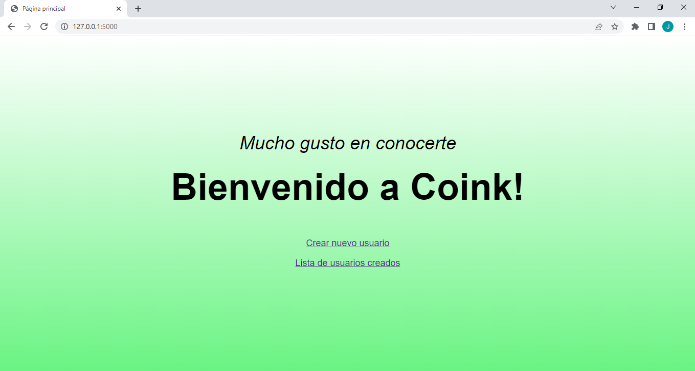

# User registration web application
> This project is a web application which creates a user registration service and displays a list of the users created.

## Objectives

- Creating a user registration service that receives a name, email and city. 
- Allowing check the list of users created by the registration service. 

## Table of content

* [Architecture](#architecture)
	* [Technology Stack](#technology-stack)
	* [Database Diagram Model](#database-diagram-model)
* [Environment](#environment)
	* [File Descriptions](#file-descriptions)
	* [Web Application Endpoints](#web-application-endpoints)
* [Installation](#installation)
* [Usage](#usage)
* [Testing](#testing)
* [Construction of this project](#construction-of-this-project)
* [Bugs](#bugs)
* [Author](#author)
* [License](#license)

##  Architecture
###  Technology Stack


###  Database Diagram Model


##  Environment
This project was developed on Ubuntu 20.04 LTS using python 3.10.4 with flask framework, connecting to a SQLite Database.

### File Descriptions

- ```app.py```  contains the entry point of the web application.
- ```config.py```  contains the configuration settings for the web application.
- ```users.db```  contains the database configured for this project (data not included).
- ```models/``` contains classes used for this project.
- ```routes/``` contains endpoints implemented for the web application.
- ```routes/home_blueprint.py``` show welcome message for the user and links to create users and to show a list of users.
- ```routes/new_user_blueprint.py``` implemented routes to create users.
- ```routes/user_list_blueprint.py``` implemented routes to check the list of users created.
- ```templates/``` contains html files used to show users and trades.
- ```forms/``` contains forms used for this project.
- ```forms/form.py``` implements a form to create new users.
- ```documentation/``` contains files used for endpoints of the web application.
- ```documentation/images``` contains images used in the readme.md file and the web application.
- ```tests/``` contains test files for this project.
- ```tests/test_user.py``` contains tests for the User model of this project.

### Web Application Endpoints

This is the list of available endpoints for this project.

|Method          |Path                           |Description                  |
|----------------|-------------------------------|-----------------------------|
|GET             |```/```                        |Welcome message to the user.  |
|POST            |```/new_user```                |Create a new user. Redirects to a confirmation page. |
|GET             |```/user_list```             	 |Show a list of all users created. | 

## Installation

1. Clone this repository
```
$   git clone "https://github.com/jcgonzalezb/user_registration_web_app.git"
```

2. Access the 'user_registration_web_app' directory:

```
$   cd user_registration_web_app
```

3. As a good practice, I suggest you create a virtual environment, e.g.

```
$   python3 -m venv myenv
```

4. Activate the new environment

```
$   source myenv/bin/activate
```

5. Install the requirements
```
$   pip install -r requirements.txt
```


6. Run the program

```
$   python3 app.py
```

Now you are running the web application and it is ready to create requests locally and test functionality, e.g.

```
 * Serving Flask app 'config' (lazy loading)
 * Environment: production
   WARNING: This is a development server. Do not use it in a production deployment.
   Use a production WSGI server instead.
 * Debug mode: on
 * Running on http://127.0.0.1:5000/ (Press CTRL+C to quit)
 * Restarting with stat
 * Debugger is active!
 * Debugger PIN: 262-635-844
```

7. To test the web application, copy the IP address from your console, e.g. http://127.0.0.1:5000 and go to the Usage in this README file.

8. When you have done, terminate the app process with Ctrl+c and deactivate the venv.

```
$ deactivate
```
## Usage

When you start the web application and copy the IP address from your console, the home page is shown. There you will see a welcome message and to links to two different endpoints.

#### Example of use

1. Go to http://127.0.0.1:5000/. There you will see a welcome message and to links to two different endpoints. The first endpoint is create a new user (Crear nuevo usuario). The second one is list of users created (Lista de usuarios creados). For this particular example, we are creating a new user and then we are going to check the list of users created.



2. Make click on the create a new user (Crear nuevo usuario) link. A form will be shown and you can fill it with the name, email and city of the user. Once the form complete, make click on create user (Crear usario)buttom. If the information is correct, you will see a form confirming that the user was created successfully. From there you have to continue to the home page.


If the form is not complete or the name or the email are already created, the web application will show you warnings and will let you know what should be done. You cannot proceed further until the form has been created correctly. If you do not want to continue, just click on the go to the home page (Ir a la pagina principal) link.


3. The next step is checking the list of users, which in this case will be the user previously created. On the home page, make click on the list of users created (Lista de usuarios creados) link. The web application will show you the list of users created.


If you want to go back to the home page, just click on the go to the home page (Ir a la pagina principal) link.

## Testing

1. In this section we are going to test the user model of this project. To run the unit tests, we run the following command in the root folder of this repository.

```
$   python3 -m unittest discover tests 2>&1
```

The terminal should show you the following:

```
.
----------------------------------------------------------------------
Ran 1 test in 0.023s

OK
```

This mean that the test was successful.


## Construction of this project

1. After creating the repository, to construct this project, the first thing to do is create the config.py file. In this file we create the app, setup the configuration for the SQLite database and use SQLALchemy to create the database using the app as parameter.

2. Next, we create the app.py file, which is the one that will run to create the web application. Inside this file we import the variables app and db from the configuration file. Also, we insert the command "db.create_all()" to create the database when the application is started. This is case the file will be users.db.

3. The next step is the creation of the models. Because at this point we are going to create users, we only need to create one model. We are going to call it User. For this purpose, we create a folder called models and inside of it, we create a file called user.py. In this file we create a class called User, which is the representation of a table called user if we were working with SQLite. Inside this class, we create the attributes name, email and city, which correspond to the columns of the users database (users.db).

4. Because this is a web application, we need to handle three endpoints. One for the home page, another for the create user functionality and a final one to show the list of users created. To handle the endpoints, we create a new folder called routes in which we will create three files, one for each endpoint. The names are home_blueprint.py, new_user_blueprint.py and user_list_blueprint.py. To create a better control of the endpoints and more modular web application, we will use a tool from Flask called Blueprint.

5. To handle the home page endpoint, we create a function which handles the home endpoint and return a html template, which contains a welcome mesage for the user and two links to access information.

6. To handle the new user endpoint, before we need to create a form supported by Flask to enter the user information. First, we create a folder called forms in the root of this repository. Inside this folder, we create a file called forms.py. Inside this file we create a class called RegisterForm which create the create the spaces inside the form to be filled by the user. It is important to mention that some validators are created to make sure that the form is filled properly. For example, if the email information filled in the form is not an actual email, the web application will make a notification to the user to fix the problem.

7. After the forms.py is complete, we create the new_user_blueprint.py file inside the routes directory. Inside the new_user_blueprint.py we create a function called new_user to get the information from the form and save it into the database. If the form is not completed properly, it will show some errors and guide the user until the form is completed properly. To show that the user was successfully created, we redirect the user one page to show confirmation.

8. The last endpoint correspond to user_list_blueprint.py file which is the one in charge of handling the list of users endpoint. In this file we create a function called list, in which we make a query of the User class to get all the information from all the users and show it in a table inside a template.

9. As mentioned above, to show the information in the endpoints, we need to create several templates. For this purpose, we create a directory called template in the root of the repository. 
inside this directory, we create the following templates: home.html, new_user.html, added_user.html and user_list.html.

10. Inside the home.html, we create a welcome message to the user and two links. One link is to redirect to the new_user.html and the other is for the user_list.html.

11. Inside the new_user.html, we used Jinja2 to create a link between the form previously created and the information filled by the user. When the user make click on the create user buttom, the information will be saved in the database and the user will be redirected to the added_user.html in which the user will be notified that the user was created successfully. There, he will have the option to return to the home page.

12. Inside the user_list.html, we used Jinja2 to create a connection between the database and the table inside the template and display a list with all the information from the users previously created. At the buttom of the template, there is the option to return to the home page.

## Bugs

No known bugs at this time.


## Authors

- Juan Camilo González <a href="https://twitter.com/juankter" target="blank"></a>
<a href="https://bit.ly/2MBNR0t" target="blank"></a>

## License

Public Domain. No copy write protection.